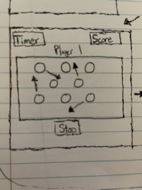

## Deployed On GH pages
https://bostonbachexchange.github.io/project_1/

Memory
--Main Page
a main page will display with the name of the game
a description of the game underneath. Click on the cards to reveal their contents. Find the cards with matching contents to collect points.

four buttons will display with four versions of the game: (rhythms, composers, note names, key names)

Goal:
1: Cards flip on click and reveal some image
2: if you match an image on the next click you get points
3: Player has ten tries to get as many matches as possible, less than five looses, five to nine is pretty good, ten matches is awesome.

Stretch Goal:
1: Theme Selection (matching rhythms, composers, keys etc). timer based bonus, more points for taking less time to answer. Players take turns, two clicks per turn. cards moving around the screen between turns.

<!-- Goal Multiplayer Stretch
1: Collect as many points as quickly as possible
2: Player with the most points wins
3: Players will gain points by clicking on a matching pair of cards -->

Documentation Page
clicking on a button will show the contents of the cards and how they match with each other. Underneath the matching card pairs will be a start button that will clear the page and start the game. 

Game Page
when the game starts, a countdown will begin under a heading for timer.
another heading displayed on the right will keep track of the score. 
Eight animated objects will display inside of a canvas and begin to move. Clicking on an object will reveal its contents. Each player will click on two object and see if they match. If the ojects match, they will disappear and the player will recieve points. 

When either all of the objects disappear, or the timer reaches zero. The game will end. When the game ends, or the timer reaches zero, the page will clear and display the score. Two buttons will apear: play again, or main page. Play again will direct back to the main page. Play again will start the game again. 

